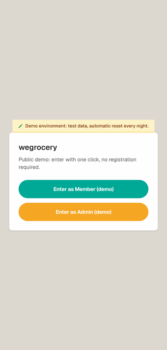

# WeGrocery

**Open-source, white-label platform for food co-ops and buying groups.**
Members place orders inside weekly cycles and track a prepaid ledger balance;
admins manage cycles, products, suppliers, top-ups, and analytics. One
codebase, MIT licensed — every group gets its own deployment with its own
name, logo, colors, and language, configured by a single environment variable.

| | |
|---|---|
| 🧪 **Try the public demo** | **[wegrocery-demo.vercel.app](https://wegrocery-demo.vercel.app)** — one-click login, fake data |
| 🟢 **In production** | [gas.portamoneta.org](https://gas.portamoneta.org) — a Milan residents' association, members only |
| 📋 **Changelog** | [English](./CHANGELOG.md) · [Italiano](./CHANGELOG.it.md) |



---

## What is this?

WeGrocery runs the weekly purchasing cycle of a buying group: members order
within a time-boxed window, the system tracks each member's prepaid balance
like a ledger, and an admin closes the cycle, charges everyone, splits
shipping, and emails the order to the supplier.

It is **not a toy demo**: it has been in production since 2025 for
[Porta Moneta](https://www.portamoneta.org), a Milan residents' association
running a food-buying group (GAS, *Gruppo di Acquisto Solidale*) that uses it
every week — real money math,
real concurrency control, real members. Porta Moneta is the first white-label
deployment of this codebase.

It is also a complete **reference implementation** of a modern Next.js app:
App Router, React Server Components, Server Actions, Better Auth, Drizzle ORM
on serverless Postgres, deployed on Vercel.

**Who it's for:**

- **Co-ops, GAS groups, buying clubs** that need an ordering + balance tool:
  run it yourself for free, or [get a turnkey instance](#want-this-for-your-group).
- **Developers** looking for a production-grade Next.js 16 / Server Actions /
  Drizzle / Neon example to learn from — contributions welcome.
- **Anyone evaluating the work** — recruiters, collaborators, potential clients.

The app ships in **English and Italian** (one language per deployment, picked
by the brand config); code, identifiers, comments, and docs are all in English.

---

## Try the demo

[**wegrocery-demo.vercel.app**](https://wegrocery-demo.vercel.app) is a fully
interactive demo running on fake data:

1. **One-click login, no signup.** Choose **"Enter as Member"** for the member
   view, or **"Enter as Admin"** for the admin panel.
2. **As a member:** place an order in the open cycle, then browse your balance,
   order history, ledger movements, and notifications.
3. **As an admin:** manage the cycle and products, record a top-up in the
   Treasury tab, review members, and open the analytics dashboard.

Data is **fake and reset automatically every night**, so click around freely —
nothing you do is permanent.

> The production site ([gas.portamoneta.org](https://gas.portamoneta.org)) is
> **private**: login is restricted to the co-op's members and holds real data.
> Use the demo to explore the app.

---

## White-label: run it for YOUR group

**[docs/self-hosting.md](docs/self-hosting.md)** takes a group from nothing
to a working installation in about 30 minutes, with a Deploy to Vercel
button that creates the project and its database: no code to touch.

Every deployment is branded by one env var, `NEXT_PUBLIC_BRAND_JSON`. No env
var = the neutral WeGrocery brand you see in the demo. Example (every field:
[docs/brand.example.json](docs/brand.example.json)):

```json
{
  "appName": "Riverside Buying Club",
  "shortName": "Riverside",
  "locale": "en",
  "currency": "EUR",
  "logoUrl": "https://example.org/logo.png",
  "supportEmail": "hello@riverside.example",
  "theme": { "primary": "#2f9e44", "accent": "#1971c2" }
}
```

Theme colours are hex (`#rgb` or `#rrggbb`). Give the fills only: the text
colour on buttons and the darker shade used for coloured text are computed so
that everything stays readable (WCAG AA). A palette that cannot reach that
contrast, or a non-hex value, logs a `[brand]` warning at startup.

Dates are shown and entered in `Europe/Rome` wall time. A group in another
zone sets `NEXT_PUBLIC_TIME_ZONE` (an IANA name, e.g. `Europe/Lisbon`); it is
inlined at build time, so redeploy after changing it.

Onboarding a new group = one Vercel project + one Neon database + one brand
JSON. Same `main` branch serves every deployment, so a bug fix or feature
lands everywhere with a single merge — no forks, no per-client branches.
The full operating model is documented in
[docs/operating-two-environments.md](./docs/operating-two-environments.md).

---

## Stack

- **Next.js 16** App Router + React 19 + TypeScript strict mode
- **Postgres** on [Neon](https://neon.tech) (HTTP driver, serverless)
- **Drizzle ORM** with hand-written migrations
- **Better Auth**: sign-in with an email link (optional Google), only for addresses in the `members` table (or with a valid membership card, where that check is set up)
- **Tailwind CSS v4** with a custom theme (orange/teal/warm white)
- **Vercel** for hosting and CI/CD (auto-deploy on push to `main`)

No charting library, no UI kit, no state-management library. The whole admin
analytics dashboard is rendered with pure CSS and inline SVG.

---

## Project structure

```
├── app/                       # Next.js App Router
│   ├── page.tsx               # Home: balance hero, open cycles, recent ledger
│   ├── ordine/                # Order form (per-product +/- steppers)
│   ├── storico/               # Order history + ledger movements
│   ├── notifiche/             # In-app notifications
│   ├── guida/                 # FAQ
│   └── admin/                 # Admin panel with 7 tabs
├── components/
│   ├── app-shell.tsx          # Layout wrapper (header, bottom nav on phones, top nav on desktop)
│   ├── home/                  # Home-only components
│   ├── admin/                 # One component per admin tab + shared modals
│   └── ui/                    # Button, Card, Toast, ConfirmDialog
├── lib/
│   ├── db/
│   │   ├── schema.ts          # Drizzle schema
│   │   ├── queries.ts         # Read-only query helpers
│   │   └── client.ts          # Neon connection
│   ├── actions/               # Server Actions (admin, order, notifications)
│   └── auth/session.ts        # requireUserSession(), requireAdmin()
├── drizzle/                   # Hand-written SQL migrations
├── auth.ts                    # Better Auth instance and auth()
├── proxy.ts                   # Auth gate (redirect to /login)
└── SETUP.md                   # Step-by-step local setup guide
```

---

## Highlight features

### For members
- **Balance hero card** — the running ledger total, big and unmissable. Turns
  red when below zero with a one-click "top up" CTA.
- **Live order draft** — quantities update in real time alongside a "balance
  after order" projection so members never accidentally overspend.
- **"Repeat last order"** — one click prefills the cart with the previous
  cycle's order, matched by product identity (so it still works after the
  admin recreates products per cycle).
- **"Next pickup" card** — promotes the most-asked information ("when do I
  pick up?") to a prominent home card with a days-until counter.
- **Notifications with per-member preferences** — bell icon with unread
  badge, deep links to the relevant cycle, and a settings page where each
  member toggles app and email delivery per category (cycle opened, closing
  reminder, order charge, order updates, wallet top-up). A scheduled job
  emails a reminder shortly before a cycle closes to members who haven't
  ordered yet.

### For admins
- **Atomic cycle close** — uses a compare-and-swap `UPDATE ... RETURNING`
  so two admins clicking "close" at the same time can never produce
  duplicate ledger entries. If charge insertion fails mid-flow, the
  status flip is rolled back so the cycle can be retried cleanly.
- **Shipping split modes** — choose between flat per-member fee or
  proportional to each member's order value. The proportional mode rounds
  each share to two decimals and absorbs sum-of-cents drift on the
  largest order so the total stays exact and reruns are deterministic.
- **Close with price adjustments** — for weight-based items (e.g. "1 kg of
  salad" weighed at 1.2 kg) the admin opens a modal, edits the per-product
  unit price, and the system recomputes every order line and ledger entry
  before posting charges.
- **Analytics dashboard** — top 10 products, revenue trend across the last
  12 closed cycles, supplier ranking, member engagement bands. Everything
  scoped to closed cycles only so the numbers are stable.
- **Insight mini-cards** — three at-a-glance metrics above the cycle list:
  cycles closing in the next 24h, members below zero balance, top product
  in the last 30 days.
- **Supplier CSV export** — one click downloads a UTF-8 CSV (with BOM, so
  Excel recognizes it) aggregated by product, ready to email to the
  supplier.
- **Catalog reuse** — supplier products live in a separate `supplier_products`
  table. When the price of a catalog item changes, the previous version is
  archived (not overwritten) so historical orders still resolve correctly.

---

## Architecture notes

### Server-first
Every page is a React Server Component that fetches its own data via
Drizzle queries. Mutations go through Next.js Server Actions with
`requireUserSession()` / `requireAdmin()` guards — the client never gets
direct DB access and never receives sensitive credentials.

### Data model
| Table | Purpose |
|---|---|
| `members` | Roster + role (`admin` / `attivi` / `utenti`) + email whitelist |
| `order_cycles` | Time-boxed purchasing windows with shipping config |
| `products` | Per-cycle catalog snapshot (so historical prices stay frozen) |
| `supplier_products` | Reusable supplier catalog with price-change history |
| `orders` | Line items: `(memberId, cycleId, productId) → quantity` |
| `ledger_entries` | Append-only balance log: top-ups, order charges, shipping |
| `notifications` | Per-member or per-role messages with read-at timestamp |
| `notification_preferences` | Sparse per-member channel toggles (absent row = code default) |
| `audit_log` | Append-only trace of admin actions |
| `suppliers` | Supplier registry |

### Concurrency
The HTTP driver (`@neondatabase/serverless`) doesn't support interactive
transactions, so all multi-statement workflows use a CAS pattern:
`UPDATE ... WHERE status='X' RETURNING ...` followed by per-row inserts,
with a manual rollback (status flip back) if a follow-up step fails.

### No charting library
The admin analytics tab draws four chart types — horizontal bar, area+line
trend, bar ranking, and a categorical split — using only Tailwind utilities
and inline SVG with a `viewBox`. Total bundle cost: zero.

### Brand layer and i18n
All user-facing strings live in typed language packs (`lib/i18n/it.ts` /
`en.ts` — the English pack is type-checked against the Italian source, so a
missing translation fails the build). Branding (name, logo, colors, locale,
currency, support emails) comes from `NEXT_PUBLIC_BRAND_JSON`, validated
fail-fast at build time in `lib/brand`. Dates and money are formatted with
`Intl` using the deployment's locale and currency. The codebase itself
(identifiers, comments, commits, docs) is in English.

---

## Local development

See [SETUP.md](SETUP.md) for the full step-by-step setup (environment,
database, a local admin, tests).

Quick start once `.env.local` is in place:

```bash
npm install
npm run db:migrate  # apply the migrations in drizzle/ to the database
npm run dev         # http://localhost:3000
```

Other scripts:

| Script | What it does |
|---|---|
| `npm run dev` | Dev server with hot reload (Next.js) |
| `npm run build` | Production build + type check |
| `npm run db:migrate` | Apply pending migrations (`drizzle/*.sql`) to the database in `.env.local` |
| `npm run doctor` | What this environment has set up, and what is missing |
| `npm test` / `npm run test:int` | Unit tests / integration tests on a test database |
| `npm run db:studio` | Drizzle Studio (visual DB browser) |

---

## Deployment

Pushing to `main` triggers a Vercel production deploy. Feature branches
get automatic preview deployments. Migrations (`drizzle/*.sql`) are applied
before the code that needs them, with `node scripts/db-migrate.mjs`, or at
every production build with `MIGRATE_ON_BUILD=true`: see
[docs/upgrading.md](docs/upgrading.md). What a deploy has set up shows in
admin → Impostazioni → *Configuration status* and in `npm run doctor`.

---

## Contributing

Contributions are welcome — this is a real product used weekly by real
groups, and improvements ship to every deployment. Start from
**[CONTRIBUTING.md](CONTRIBUTING.md)**: how to report a bug, propose a
feature, set up the project and open a pull request (against `staging`).
Security issues go through [SECURITY.md](SECURITY.md), never a public issue;
everyone follows the [Code of Conduct](CODE_OF_CONDUCT.md). If you run
WeGrocery for your own group, a star and a note about your setup help a lot.

---

## License

Code is [MIT licensed](./LICENSE) — fork it, adapt it, run it for your own
group. The "Porta Moneta" name, logo, and the `portamoneta.org` domain belong
to APS Porta Moneta and are **not** covered by the license; client brand
configurations are private to each deployment.

---

<a name="want-this-for-your-group"></a>
## Want this for your group?

**Run it yourself** — it's free and MIT licensed: clone, deploy, set your
brand JSON.

**Or get it done for you.** I set up turnkey, white-label instances — your
logo, colors, language, and domain, like the Porta Moneta deployment — and
build custom features on top. Get in touch:
[LinkedIn](https://www.linkedin.com/in/federicodecillia) ·
[GitHub](https://github.com/federicodecillia)

---

Built with [Claude Code](https://claude.com/claude-code) — architected and reviewed by a human, executed by an agent.
